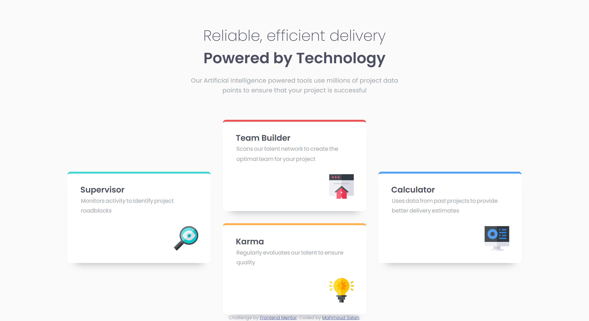

# Frontend Mentor - Four card feature section solution

This is a solution to the [Four card feature section challenge on Frontend Mentor](https://www.frontendmentor.io/challenges/four-card-feature-section-weK1eFYK). Frontend Mentor challenges help you improve your coding skills by building realistic projects. 

## Table of contents

- [Overview](#overview)
  - [Screenshot](#screenshot)
  - [Links](#links)
- [Built with](#built-with)
- [Author](#author)

## Overview

### Screenshot

### Links

- Solution URL: [Four card feature section](https://github.com/Mahmoud2227/four-card-feature-section-frontendmentor)
- Live Site URL: [Four card feature section Live](https://mahmoud2227.github.io/four-card-feature-section-frontendmentor)

## My process

### Built with

- Semantic HTML5 markup
- CSS custom properties
- Flexbox
- Grid

## Author

- Frontend Mentor - [Mahmoud Salah](https://www.frontendmentor.io/profile/Mahmoud2227)
